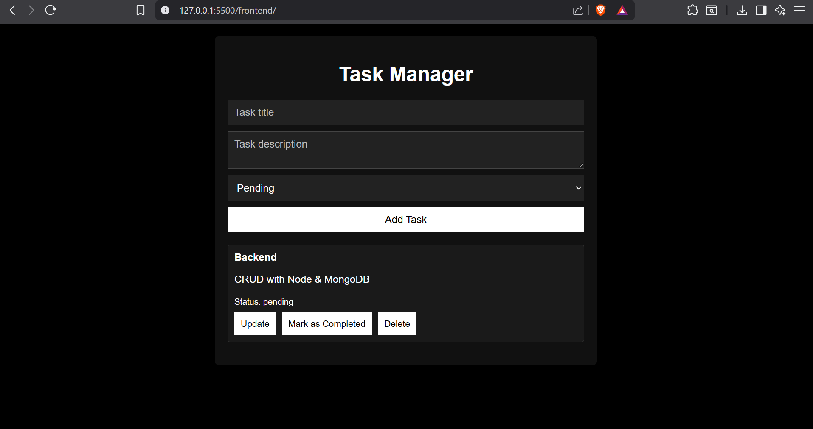
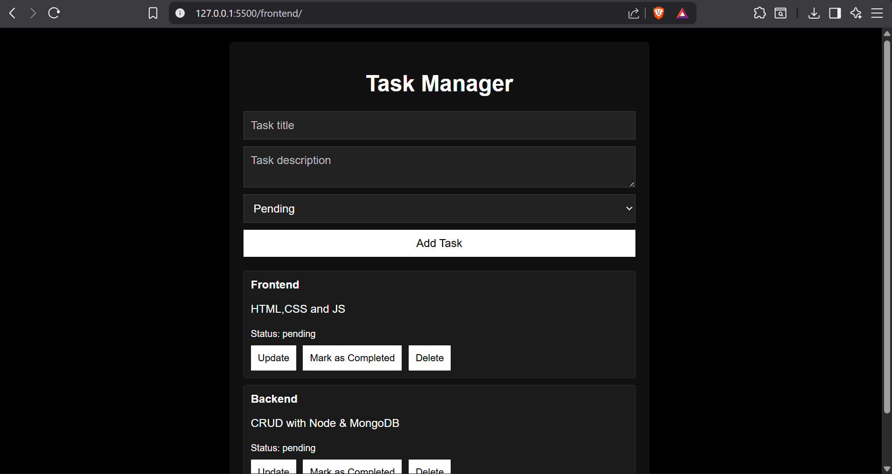
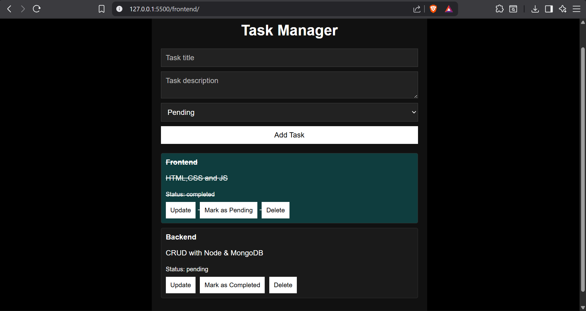
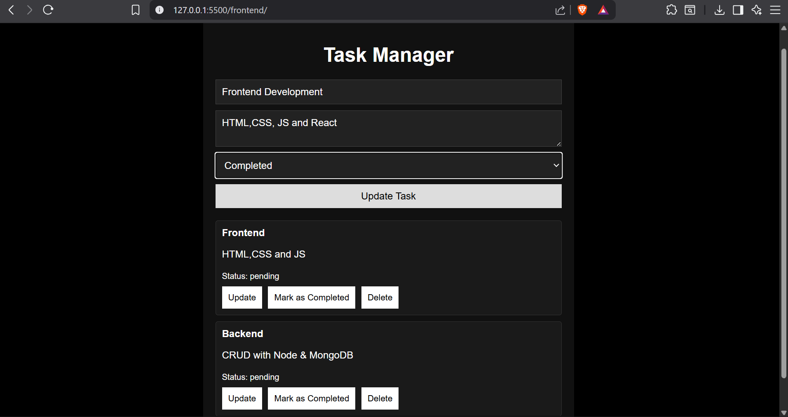

# Task Manager Web Application

A full-stack Task Management Web Application that allows users to create, view, update, and delete tasks.
The application uses a RESTful API with persistent data storage and a clean, responsive user interface.

---

## 🚀 Features

- Create new tasks with title, description, and status
- View all tasks in a list
- Update task details (title, description, status)
- Mark tasks as Pending or Completed
- Delete tasks
- Responsive dark-themed UI
- Persistent data storage using MongoDB

---

## 📸 Application Screenshots (Frontend)

### Home Page


### Add Task Form


### Task Added (Pending State)


### Task Completed (Status Update)


### Update Task (Edit Mode)


---

## 🛠️ Tech Stack

### Frontend
- HTML
- CSS
- JavaScript (Vanilla)

### Backend
- Node.js
- Express.js

### Database
- MongoDB
- Mongoose ODM

---

## 📂 Project Structure

```text
task-manager/
│
├── backend/
│   ├── config/
│   │   └── db.js
│   ├── controllers/
│   │   └── task.controller.js
│   ├── models/
│   │   └── Task.js
│   ├── routes/
│   │   └── task.routes.js
│   ├── server.js
│   ├── package.json
│   └── .env
│
├── frontend/
│   ├── index.html
│   ├── style.css
│   └── script.js
│
├── .gitignore
└── README.md
```

---

## ⚙️ Setup Instructions (Run Locally)

Follow the steps below to run the project on your local machine.

---

### 1️⃣ Clone the Repository

```bash
git clone https://github.com/vishu2724/task-manager
cd task-manager

2️⃣ Backend Setup
Move into the backend folder:
cd backend
Install dependencies:
npm install

3️⃣ Environment Variables
Create a .env file inside the backend folder:
PORT=5000
MONGO_URI=mongodb://127.0.0.1:27017/task_manager
Make sure MongoDB is installed and running on your system.

4️⃣ Start the Backend Server
node server.js
Expected output:
MongoDB connected
Server running on port 5000

5️⃣ Frontend Setup
Go to the frontend folder
Open index.html in your browser
No frontend server is required.

🔗 API Endpoints
Method	Endpoint	Description
POST	/api/tasks	Create a new task
GET	/api/tasks	Get all tasks
PUT	/api/tasks/:id	Update a task
DELETE	/api/tasks/:id	Delete a task

🧪 Sample Task Object
{
  "title": "Learn Backend",
  "description": "CRUD using Node and MongoDB",
  "status": "pending"
}

⭐ If you like this project
Give it a ⭐ on GitHub!

---
